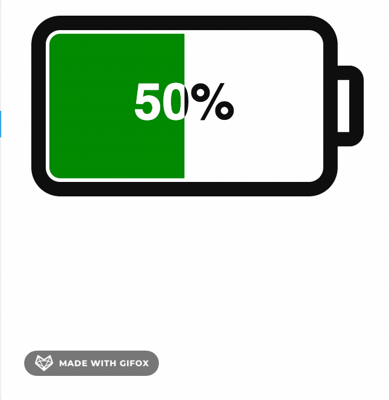

# React Battery Gauge

This library is a SVG based react component for displaying battery status, ultra lightweight, highly customizable with zero dependencies
## Live Demo
[Click here](https://umerbhat.github.io/react-battery-gauge/)
## Short Demo

## Storybook Demo

[Click here](https://master--61c950606cc89f003a4379c2.chromatic.com/)

## Usage

Install it by running 
```bash
npm install react-battery-gauge # or yarn add react-battery-gauge
```
## Include the component:

```jsx
import BatteryGauge from 'react-battery-gauge'

<BatteryGauge value={40} />
```

## Options

| Name          | Description                                                                                                                                              | Default      | type                      |
|---------------|----------------------------------------------------------------------------------------------------------------------------------------------------------|--------------|---------------------------|
| value         | Meter value range [0-maxValue(100)]                                                                                                                      | 50           | number                    |
| maxValue      | Meter max value                                                                                                                                          | 100          | number                    |
| orientation   | Changes orientation, keeping text horizontal                                                                                                             | "horizontal" | "horizontal"\| "vertical" |
| padding       | Padding of gauge within canvas                                                                                                                           | 5            | number                    |
| size          | We don't like passing both width and height, can create unusual looking shape. Size will help gauge to achieve the desired size maintaining aspect ratio | 300          | number                    |
| aspectRatio   | Gauge aspect ratio, At padding 0 easy to create battery types -> D = 0.56, C = 0.52, AA = 0.28, AAA = 0.23, AAAA = 0.19 , default C battery              | 0.52         | number                    |
| animated      | Enable animation on mount                                                                                                                                | false        | boolean                   |
| charging      | Enable charging mode                                                                                                                                 | false        | boolean                   |
| customization | All individual components customisation                                                                                                                  | GaugeCustom  | Partial<TGaugeCustom>     |

## Override any customization default values:
```js
{
  batteryBody: {
    strokeWidth: 4,
    cornerRadius: 6,
    fill: 'none',
    strokeColor: '#111'
  },
  batteryCap: {
    fill: 'none',
    strokeWidth: 4,
    strokeColor: '#111',
    cornerRadius: 2,
    capToBodyRatio: 0.4
  },
  batteryMeter: {
    fill: 'green',
    lowBatteryValue: 15,
    lowBatteryFill: 'red',
    outerGap: 1,
    noOfCells: 1, // more than 1, will create cell battery
    interCellsGap: 1
  },
  readingText: {
    lightContrastColor: '#111',
    darkContrastColor: '#fff',
    lowBatteryColor: 'red',
    fontFamily: 'Helvetica',
    fontSize: 14,
    showPercentage: true
  },
  chargingFlash: {
    scale: undefined,
    fill: 'orange',
    animated: true,
    animationDuration: 1000
  },
}
```


## License

MIT

**Free Software, Your contribution is welcome!**

